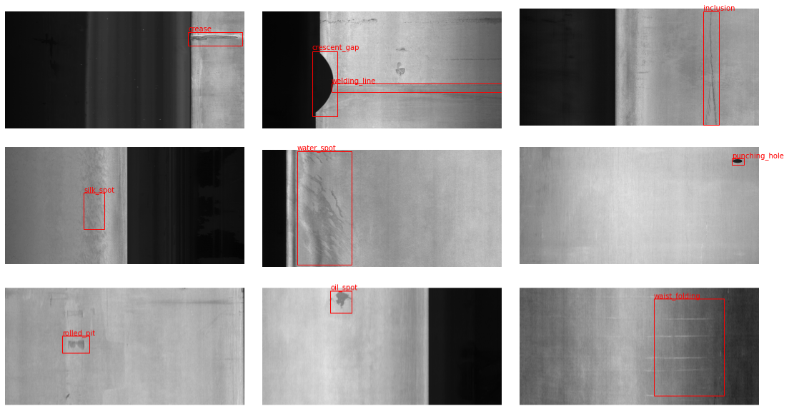
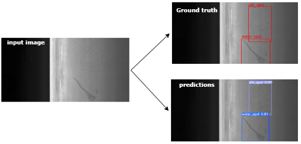

# Metal Surface Defect Detection

## Problem Statement

Quality control in metal manufacturing requires identifying surface defects that can compromise structural integrity and product quality. Manual inspection is time-consuming, subjective, and impractical for high-volume production lines. This project addresses the need for automated, real-time defect detection systems that can be deployed in production environments such as conveyor belt systems.



The system targets six critical defect categories commonly found in steel surface manufacturing:
1. Rolled-in scale
2. Patches
3. Crazing
4. Pitted surface
5. Inclusion
6. Scratches

## Solution Overview

An automated defect detection system leveraging YOLOv5 deep learning architecture for real-time quality control. The system combines object detection and classification to identify and localize surface defects with inference speeds suitable for production deployment.



## Technical Approach

### Architecture Selection

**YOLOv5** was selected over Faster R-CNN due to:
- Real-time inference capability (critical for conveyor belt deployment)
- Superior speed-accuracy tradeoff for production environments
- Efficient single-stage detection architecture
- Production-ready deployment options

### Methodology

1. **Transfer Learning with Backbone Freezing**: 
   - Leveraged pre-trained YOLOv5 weights trained on COCO dataset
   - Freeze backbone layers (feature extraction) while fine-tuning detection head
   - Reduces training time and improves convergence for domain-specific detection
   
2. **Fine-tuning**: Adapted detection head to metal surface defect domain using custom dataset

3. **Optimization**: Configured for real-time inference in production scenarios

## Project Structure

```
Metal-Surface-Defect-Detection/
├── README.md
├── train.py                    # Training pipeline
├── detect.py                   # Inference script
├── dataset_module.py           # Dataset handling utilities
├── utils.py                    # Helper functions
├── requirements.txt            # Dependencies
├── setup.py                    # Dataset setup and preprocessing
├── scripts/
│   ├── evaluate_model.py       # Model evaluation and metrics
│   └── visualize_results.py    # Results visualization
├── examples/
│   ├── EDA.ipynb              # Exploratory data analysis
│   └── real_time_detection.ipynb  # Real-time inference demo
├── models/
│   └── README.md              # Model checkpoints location
├── yolov5/
│   └── custom_dataset.yaml    # Dataset configuration
└── docs/
    └── TRAINING.md            # Training documentation
```

## Installation

### Prerequisites
- Python 3.10+
- Conda package manager
- CUDA-capable GPU (recommended for training)

### Setup

```bash
# Clone repository
git clone https://github.com/yourusername/Metal-Surface-Defect-Detection.git
cd Metal-Surface-Defect-Detection

# Create conda environment
conda create -n metal-defect python=3.10
conda activate metal-defect

# Install dependencies
pip install -r requirements.txt

# Download and setup dataset
python setup.py
```

## Usage

### Training

**Basic Training:**
```bash
python train.py --data yolov5/custom_dataset.yaml \
                --epochs 100 \
                --batch-size 16 \
                --img-size 640 \
                --weights yolov5s.pt \
                --project runs/train \
                --name experiment_1
```

**Transfer Learning (Recommended):**
Freeze backbone layers for faster convergence and better performance:
```bash
python train.py --data yolov5/custom_dataset.yaml \
                --epochs 100 \
                --batch-size 16 \
                --img-size 640 \
                --weights yolov5s.pt \
                --freeze-backbone \
                --project runs/train \
                --name transfer_learning_exp
```

**Transfer Learning with Class Balancing (Best for Imbalanced Datasets):**
```bash
python train.py --data yolov5/custom_dataset.yaml \
                --epochs 100 \
                --batch-size 16 \
                --weights yolov5s.pt \
                --freeze-backbone \
                --class-weights \
                --project runs/train \
                --name balanced_training
```

> **Note on Class Imbalance:** The dataset has an 11.9:1 imbalance ratio (silk_spot: 25% vs crease: 2.1%). Using `--class-weights` applies automatic balancing to improve performance on minority classes.

**Using Medium Model:**
```bash
python train.py --data yolov5/custom_dataset.yaml \
                --epochs 100 \
                --batch-size 8 \
                --weights yolov5m.pt \
                --freeze-backbone \
                --project runs/train \
                --name yolov5m_frozen
```

> **Note:** `--freeze-backbone` freezes the first 10 layers (backbone/feature extractor) while keeping the detection head trainable. This is the standard YOLOv5 transfer learning approach.

### Inference

```bash
python detect.py --weights models/best.pt \
                 --source path/to/images \
                 --img-size 640 \
                 --conf-thres 0.5 \
                 --save-results
```

### Evaluation

```bash
python scripts/evaluate_model.py --weights models/best.pt \
                                  --data yolov5/custom_dataset.yaml \
                                  --output results/
```

## Dataset

The project uses the [Severstal Steel Defect Dataset](https://www.kaggle.com/datasets/zhangyunsheng/defects-class-and-location) containing:
- 6 defect classes
- Annotated bounding boxes
- Train/validation split

## Results

### Model Performance

The model was trained for 10 epochs on the steel defect dataset using YOLOv5s architecture with the following results:

| Metric | Value |
|--------|-------|
| Precision | 60.4% |
| Recall | 61.0% |
| mAP@0.5 | 63.3% |
| mAP@0.5:0.95 | 31.7% |
| Training Time | 40.4 minutes |

### Training Curves


*Training and validation metrics progression showing loss reduction and mAP improvement over epochs*

### Confusion Matrix


*Confusion matrix showing model performance across different defect categories*

### Sample Training Data


*Distribution of defect classes in the training dataset*


*Sample training batch showing augmented images with bounding box annotations*

### Performance Analysis

The model demonstrates balanced performance across precision and recall metrics, indicating effective defect detection without excessive false positives or missed detections. The mAP@0.5 of 63.3% shows strong localization accuracy suitable for production deployment scenarios.

## Technical Stack

- **Framework**: PyTorch, Ultralytics YOLOv5
- **Computer Vision**: OpenCV, Albumentations
- **Visualization**: Matplotlib, Pillow
- **Data Processing**: NumPy, Pandas
- **Experiment Tracking**: Comet ML

## Development

### Running Tests

```bash
pytest tests/
```

### Code Structure

- `dataset_module.py`: Dataset loading and preprocessing
- `utils.py`: Utility functions for data transformation
- `train.py`: Model training pipeline
- `detect.py`: Inference and detection pipeline

## Future Improvements

- Model quantization for edge deployment
- Multi-scale inference for improved accuracy
- Integration with industrial PLC systems
- Expanded defect taxonomy

