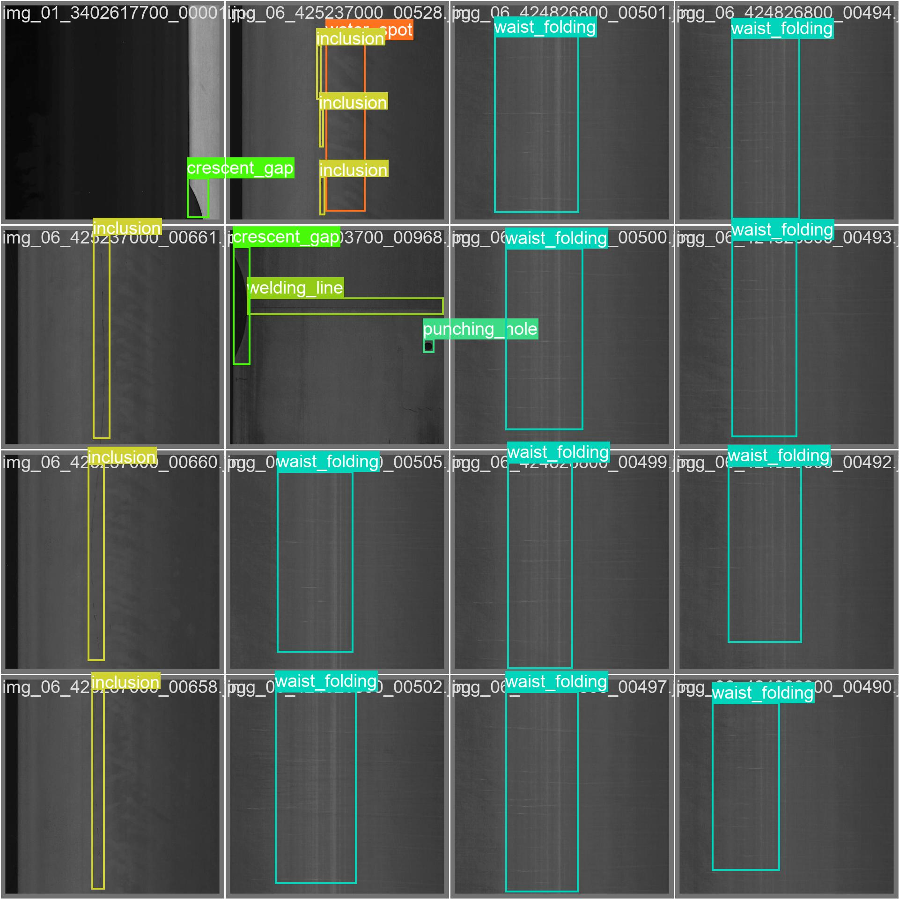

# Metallic-Surface-Defect-Detection



### Description of the problem: 
The current task at hand involves object detection, encompassing both a classification challenge and a localization task. While one potential approach was to develop a custom architecture from scratch, I opted to streamline the pipeline creation process by leveraging a prebuilt and pre-trained model. In this regard, I had two viable choices: Faster R-CNN and YOLOV5. Ultimately, I chose YOLOV5 due to its compatibility with a specific use case wherein the algorithm would be deployed on a camera affixed to a conveyor belt.

The decisive factor for this choice was YOLOV5's impressive capability to execute real-time defect detection. This aspect holds particular significance for scenarios involving defect identification along the conveyor belt. YOLOV5 has notably outperformed other architectures, including Faster R-CNN, in this context.

Once YOLOV5 was selected, the subsequent step involved transfer learning. This encompassed utilizing pre-existing weights and subsequently training the model using available images showcasing defects.

### Usage

to use the library, simply use pip install : 

```shell
pip install msd_detection
```
then, use the function detect_defects() : 

```
from msd_detection import detect_defects
image = 'metal_surface.jpg'
output = detect_defects(image)
```


